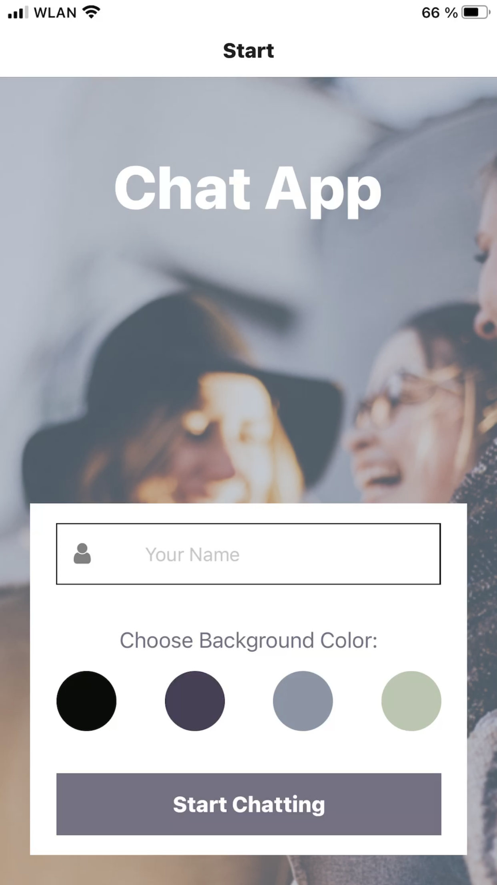
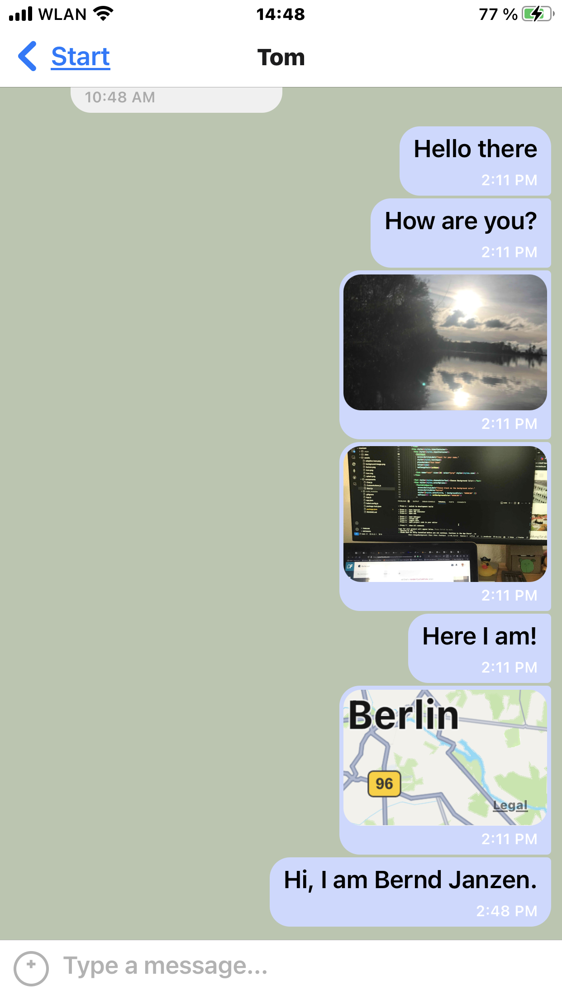

# React Native Chat App

This is a mobile chat application built using React Native, Expo, and Google Firestore Database. The app allows users to chat with friends and family, send messages, share images, and exchange location data.

## Table of Contents

-   [Introduction](#introduction)
-   [Screenshots](#screenshots)
-   [Features](#features)
-   [User Stories](#user-stories)
-   [Technical Requirements](#technical-requirements)
-   [Directions for Setting Up the Environment](#directions-for-setting-up-the-environment)
-   [Usage](#usage)

## Introduction

The React Native Chat App project was developed as part of Achievement 5 of my fullstack bootcamp curriculum. The goal of this project is to demonstrate proficiency in React Native development, including the integration of real-time chat functionality, image sharing, location sharing, and offline data storage.

## Screenshots

## Features

-   User authentication via Google Firebase authentication
-   Real-time chat functionality using Gifted Chat library
-   Image sharing from device's image library and camera
-   Location sharing with map view integration
-   Offline message storage using asyncStorage

## User Stories

-   As a new user, I want to easily enter a chat room to start talking to friends and family quickly.
-   As a user, I want to send messages to exchange the latest news with friends and family.
-   As a user, I want to share images to show what I’m currently doing.
-   As a user, I want to share my location to show where I am.
-   As a user, I want to read messages offline to reread conversations at any time.
-   As a visually impaired user, I want to use a chat app compatible with a screen reader to engage with the chat interface.

## Technical Requirements

-   Written in React Native
-   Developed using Expo
-   Styled according to given screen designs
-   Chat conversations stored in Google Firestore Database
-   User authentication via Google Firebase authentication
-   Chat conversations stored locally
-   Images stored in Firebase Cloud Storage
-   Location data retrieval and sharing
-   Accessibility considerations applied to app design and development

## Directions for Setting Up the Environment

-   Install <a href="https://nodejs.org/en/learn/getting-started/how-to-install-nodejs">Node JS</a> on your device
-   In the terminal: Install Expo globally: `npm install -g expo-cli`
-   Sign up for an <a href="https://expo.dev/">Expo Account </a> to be able to run the app on your device
-   Clone this repository
-   Navigate to the folder and run `npm install`
-   Use your own Firebase configuration code:
    -   Sign in at [Google Firebase](https://firebase.google.com/)
    -   **Create a Project** (uncheck **Enable Google Analytics for this project**)
    -   **Create Database** in **Firestore Database** (choose a close region from the dropdown, and **Start in production mode**)
    -   Change `allow read, write: if false;` to `allow read, write, if true;` in **Rules** tab
    -   **Register app(`</img>`)** in **Project Overview**
    -   Now, follow the provided directions of adding Firebase SDK:
        -   Install firebase: `npm install firebase`
        -   Initialize firebase: Copy and paste the provided Firebase configuration and change them in the _App.js_ of the downloaded repository
-   Download Android Studio(Win) or iOS Simulator/XCode(Mac)
-   Run `expo start` in the terminal. Follow the instruction to access the app via the iOS Simulator/Android Emulator

## Usage

Once the development server is running, you can use the Expo client app (Expo Go) to view the app on your mobile device or an emulator.
